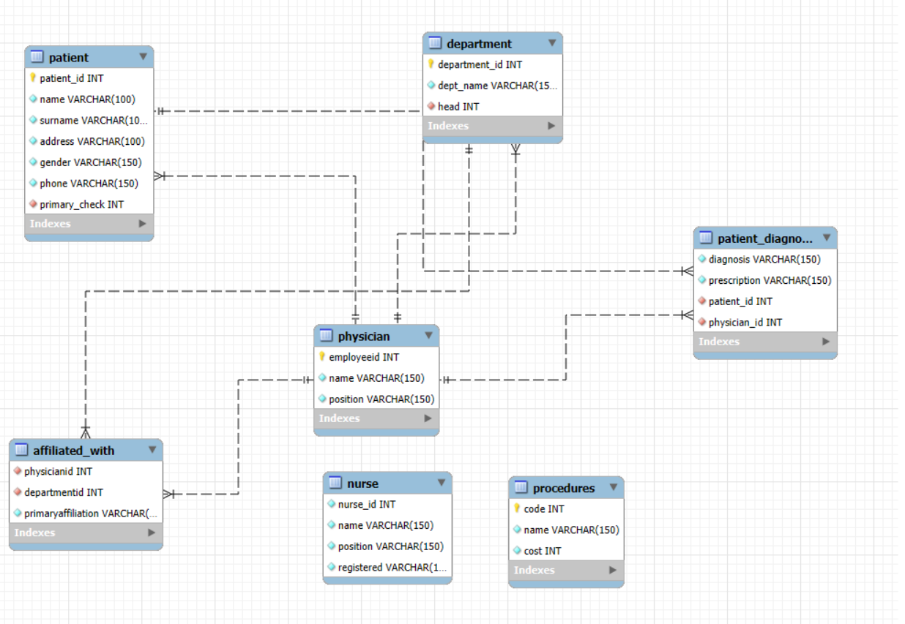

# 🏥 Hospital Management System (HMS) Database Project

**Author:** Ornab Biswass  
**Course:** DB Course Project(Updated)
**Date:** June 2021. Updated: Sep 2025

---

## 📘 Project Overview

This project presents a SQL-based Hospital Management System (HMS) designed to simulate real-world hospital operations. It includes relational tables for physicians, nurses, patients, departments, procedures, and diagnoses. The system supports data insertion, retrieval, updates, and complex queries to manage hospital workflows efficiently.

---

## 🧩 Part 1: Database Design & Schema

### 🔹 Main Tables

- **Physician** – Stores doctor information (ID, name, position).
- **Department** – Contains department details and references the head physician.
- **Affiliated_with** – Maps physicians to departments.
- **Nurse** – Stores nurse details, including registration status.
- **Patient** – Contains patient's personal info and primary physician reference.
- **Patient_Diagnosis** – Records diagnoses and prescriptions.
- **Procedures** – Lists medical procedures and their costs.

### 📊 ERD / Schema Diagram

## 🧾 Part 2: Table Creation & Data Insertion

### 🔹 Description

Tables were created using `CREATE TABLE` statements with appropriate constraints (`PRIMARY KEY`, `FOREIGN KEY`). Sample data was inserted using `INSERT INTO` statements to simulate realistic hospital records.

---

## 🔍 Part 3: SQL Queries

### 🔹 Description

This section demonstrates SQL queries for CRUD operations and relational data retrieval using `JOIN`s and subqueries.

### 🧪 Sample Queries

- Retrieve physician names in alphabetical order.
- Get full names of male patients.
- Find nurses who are department heads and registered.
- Calculate the average cost of medical procedures.
- Find the second-highest cost procedure.
- Retrieve patients with their primary physician and diagnosis.
---

## 🔧 Part 4: Data Retrieval & Manipulation

### 🔹 Description

This section highlights how data is accessed and modified:

- View all patient details.
- Join tables to show physician-patient relationships.
- Use `WHERE`, `LIKE`, and aggregate functions.
- Update patient names and drop columns.

---

## 🧠 Part 5: Advanced Queries (Subqueries & Aggregates)

### 🔹 Description

Advanced SQL techniques are used to extract meaningful insights:

- Subqueries to find patients with chronic pain.
- Compare average costs of procedures.
- Identify physicians with multiple affiliations.
---

## ✅ Part 6: Conclusion

### 🔹 Summary

The HMS database project showcases how SQL can be used to build and manage a hospital system. It covers schema design, data operations, and analytical queries to reflect real-world healthcare data management.

### 🎓 Learning Outcomes

- Design normalised relational schemas.
- Implement foreign key relationships.
- Write complex queries using `JOIN`s, subqueries, and aggregates.
- Model hospital workflows through database logic.

---
